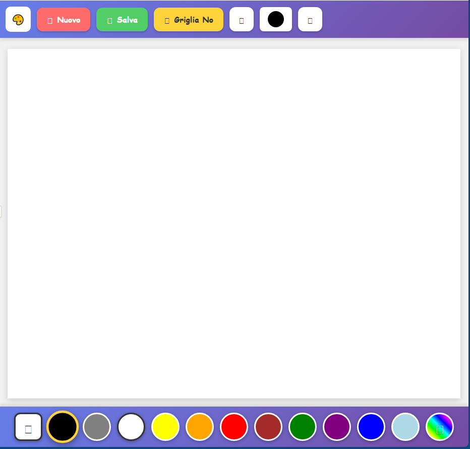

# 🎨 BabyPaint

Un'applicazione di disegno semplice e divertente pensata per i bambini, ottimizzata per tablet in modalità landscape.

Provala online!: https://baby-paint.vercel.app/



## ✨ Caratteristiche

- **🖌️ Disegno Multitouch**: I bambini possono disegnare con più dita contemporaneamente
- **🎨 Palette Colori**: 10 colori predefiniti + color picker avanzato con centinaia di colori + Gomma
- **📏 Dimensione Pennello Regolabile**: Da 0.5rem a 5rem con incrementi di 0.5rem
- **🗑️ Gomma**: Per correggere gli errori
- **📐 Griglia Opzionale**: Griglia 2rem x 2rem per aiutare i bambini a disegnare
- **💾 Salvataggio**: Esporta i disegni in formato PNG con timestamp
- **🔒 Anti-Zoom**: Impedisce zoom e pan accidentali durante il disegno
- **📱 Responsive**: Ottimizzato per tablet in landscape, funziona anche su desktop

## 🚀 Come Usare

1. **Scarica il progetto**:
   ```bash
   git clone https://github.com/Emax83/BabyPaint.git
   cd BabyPaint
   ```

2. **Apri l'applicazione**:
   - Apri il file `index.html` direttamente nel browser
   - Oppure usa un server locale:
     ```bash
     # Con Python 3
     python -m http.server 8000
     
     # Con Node.js (http-server)
     npx http-server
     ```

3. **Inizia a disegnare**:
   - Tocca il canvas con le dita per disegnare
   - Seleziona colori dalla barra inferiore
   - Usa i pulsanti + e - per cambiare la dimensione del pennello
   - Premi "Nuovo" per cancellare il disegno
   - Premi "Salva" per scaricare il disegno

## 🛠️ Tecnologie Utilizzate

- **HTML5 Canvas**: Per il disegno
- **Vanilla JavaScript**: Nessuna dipendenza framework
- **CSS3**: Animazioni e layout responsive
- **Bootstrap Icons**: Icone dell'interfaccia
- **html2canvas**: Per l'esportazione in PNG

## 📦 Dipendenze Esterne

Le seguenti librerie sono caricate via CDN:

- [Bootstrap Icons](https://icons.getbootstrap.com/) v1.11.1
- [html2canvas](https://html2canvas.hertzen.com/) v1.4.1

## 🎮 Funzionalità Dettagliate

### Toolbar Superiore
- **Logo**: Placeholder per logo personalizzato
- **Nuovo**: Pulisce il canvas
- **Salva**: Scarica il disegno come PNG (formato: `Disegno_AAAAMMGGHHII.png`)
- **Griglia Si/No**: Mostra/nasconde una griglia di aiuto
- **+ / -**: Aumenta/diminuisce la dimensione del pennello
- **Anteprima Pennello**: Mostra dimensione e colore corrente

### Barra Colori Inferiore
- **Gomma**: Cancella parti del disegno
- **11 Colori Base**: Nero, Grigio, Bianco, Giallo, Arancione, Rosso, Marrone, Verde, Viola, Blu, Azzurro
- **Palette Multicolore**: Apre un picker con centinaia di colori aggiuntivi

### Canvas
- **Disegno Multitouch**: Supporta più dita contemporaneamente
- **Prevenzione Zoom**: Blocca zoom/pan indesiderati
- **Griglia Opzionale**: Celle 2rem x 2rem per guidare il disegno

## 🎯 Ottimizzazioni per Bambini

- **Font Comic Sans**: Carattere giocoso e amichevole
- **Pulsanti Grandi**: Facili da toccare per le dita piccole
- **Colori Vivaci**: Interfaccia colorata e attraente
- **Feedback Visivo**: Animazioni e scale al click
- **Semplicità**: Interfaccia intuitiva senza menu complessi

## 📱 Compatibilità

- ✅ Safari (iOS/iPadOS)
- ✅ Chrome (Android/Desktop)
- ✅ Firefox (Desktop)
- ✅ Edge (Desktop)

Testato principalmente su iPad in modalità landscape.

## 🔧 Personalizzazione

### Cambiare il Logo
Sostituisci l'emoji nella classe `.logo` con un'immagine:
```css
.logo {
    background-image: url('path/to/logo.png');
    background-size: contain;
}
```

### Modificare i Colori Predefiniti
Modifica l'HTML nella sezione `.color-bar`:
```html
<div class="color-btn" style="background: #yourcolor;" onclick="selectColor('#yourcolor')"></div>
```

### Cambiare Dimensioni Griglia
Modifica la variabile `cellSize` nella funzione `drawGrid()`:
```javascript
const cellSize = 3 * 16; // 3rem invece di 2rem
```

## 📄 Licenza

Questo progetto è rilasciato sotto licenza MIT. Vedi il file [LICENSE](LICENSE) per i dettagli.

## 👨‍💻 Autore

Creato da [Emax83](https://github.com/Emax83)

## 🤝 Contribuire

I contributi sono benvenuti! Sentiti libero di:

1. Fare un Fork del progetto
2. Creare un branch per la tua feature (`git checkout -b feature/AmazingFeature`)
3. Committare le modifiche (`git commit -m 'Add some AmazingFeature'`)
4. Pushare al branch (`git push origin feature/AmazingFeature`)
5. Aprire una Pull Request

## 🐛 Segnalazione Bug

Hai trovato un bug? Apri una [Issue](https://github.com/Emax83/BabyPaint/issues) con:
- Descrizione del problema
- Passi per riprodurlo
- Browser e versione
- Screenshot se possibile

## 💡 Idee per Miglioramenti Futuri

- [ ] Undo/Redo
- [ ] Forme predefinite (cerchio, quadrato, stella)
- [ ] Timbri e stickers
- [ ] Salvataggio automatico locale
- [ ] Galleria disegni salvati
- [ ] Modalità sfondi colorati
- [ ] Texture pennello (spray, matita, pennarello)
- [ ] Supporto per importare immagini di sfondo

## 🙏 Ringraziamenti

- Bootstrap Icons per le icone
- html2canvas per l'esportazione immagini
- La community open source

---

⭐ Se ti piace questo progetto, lascia una stella su GitHub!